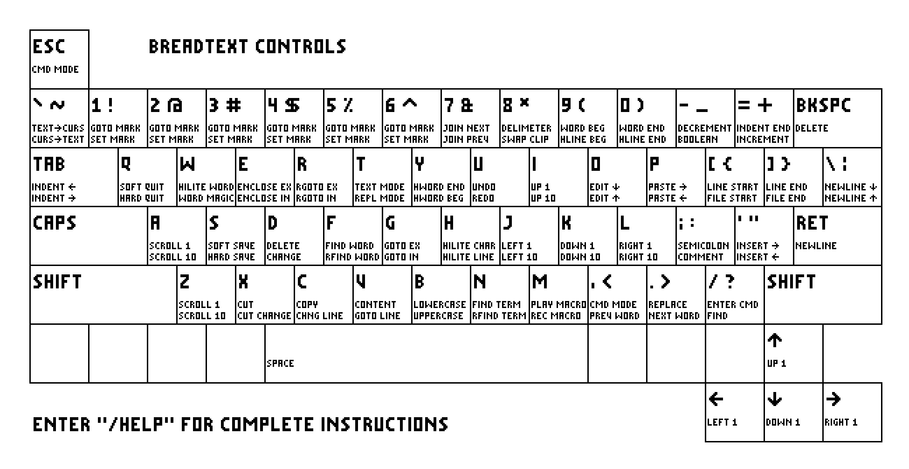

# BreadText

**Version 1.4.0**


A terminal-based text editor by Jack Eisenmann


If you find any bugs, please report them on GitHub.

## Design Goals

* Focus on editing code and plain text
* Stay lightweight and fast
* Offer intuitive, ergonomic controls
* Use the system-wide clipboard by default
* Allow extending functionality through scripting
* Bread

## Installation

BreadText is compatible with Linux and macOS.

On Linux systems, you will first need to install xclip and ncurses. (This step is not necessary on macOS.) If you are using Ubuntu, you can run:

```
sudo apt-get install xclip
sudo apt-get install libncurses-dev
```

Then compile and install BreadText:

```
make
sudo make install
```

Hint: You may want to adjust the brightness levels of ANSI colors in your terminal.

## Controls

To view controls within BreadText, enter `/help`.



### Save and Quit

`S` = Save  
`Shift + S` = Save over modified file  
`Q` = Quit  
`Shift + Q` = Quit without saving

### Changing Modes

`T` = Text-entry mode  
`Shift + T` = Text-replace mode  
`O` = Insert line before cursor and enter text-entry mode  
`Shift + O` = Insert line after cursor and enter text-entry mode  
`, + , (again)` or `Escape` = Exit text-entry mode and enter command mode  
`,` or `Escape` = Exit highlight mode and enter command mode  
`H` = Character highlight mode  
`Shift + H` = Line highlight mode  
`W` = Word highlight mode  
`Shift + W` = Highlight word with magic  
`E` = Exclusive enclosure highlight mode  
`Shift + E` = Inclusive enclosure highlight mode  
`9` = Select until beginning of line exclusive  
`Shift + 9` = Select until beginning of line inclusive  
`0` = Select until end of line exclusive  
`Shift + 0` = Select until end of line inclusive  
`/` = Enter command  
`Shift + /` = Enter find command  
`V` = Highlight line without indentation or newline  
`Shift + V` = Enter gotoLine command  
`Shift + Tab` = Paste in text command entry

### Movement

`IJKL` or `Arrow Keys` = Scroll one character  
`Shift + IJKL` = Scroll 10 characters  
`AZ` = Scroll text one line  
`Shift + AZ` = Scroll text 10 lines  
`` ` `` = Scroll text to cursor  
``Shift + ` `` = Scroll cursor to text  
`[]` = Scroll to beginning or end of line  
`{}` = Scroll to beginning or end of file  
`=` = Scroll to end of indentation  
`8` = Jump to matching delimiter  
`G` = Go to character exclusive  
`Shift + G` = Go to character inclusive  
`R` = Reverse go to character exclusive  
`Shift + R` = Reverse go to character inclusive  
`N` = Find next instance  
`Shift + N` = Find previous instance  
`F` = Find next instance of word under cursor  
`Shift + F` = Find previous instance of word under cursor  
`1-6` = Go to mark  
`Shift + 1-6` = Set mark

### Highlight Actions

`D` = Delete  
`Shift + D` = Delete and enter text-entry mode  
`C` = Copy  
`Shift + C` = Change lines  
`X` = Cut  
`Shift + X` = Cut and enter text-entry mode  
`P` = Paste after cursor  
`Shift + P` = Paste before cursor  
`*` = Swap selection with clipboard  
`Y` = Use internal clipboard  
`Shift + Y` = Use system clipboard

### History

`M` = Play macro  
`Shift + M` = Start or stop recording macro  
`U` = Undo  
`Shift + U` = Redo

### Text Manipulation

`<>` = Indent  
`Tab` or `Shift + Tab` = Indent  
`.` = Replace character under cursor  
`'` = Insert character after cursor  
`Shift + '` = Insert character before cursor  
`\` = Insert line after cursor  
`Shift + \` = Insert line before cursor  
`;` = Toggle semicolon at end of line  
`:` = Toggle comment at beginning of line  
`B` = Lowercase  
`Shift + B` = Uppercase  
`+` = Increment number under cursor  
`-` = Decrement number under cursor  
`_` = Toggle boolean literal  
`7` = Join next line and current line  
`Shift + 7` = Join previous line and current line

### Commands

`/gotoLine (line number)`  
`/find (pattern)`  
`/reverseFind (pattern)`  
`/findWord (word)`  
`/reverseFindWord (word)`  
`/regex (regex)`  
`/reverseRegex (regex)`  
`/replace (pattern) (text)`  
`/get (config variable)`  
`/set (config variable) (value)`  
`/getPath`  
`/setPath (path)`  
`/version`  
`/help`

### Configuration Variables

`colorScheme`: 0 is black on white, 1 is white on black.  
`shouldUseHardTabs`: 0 means no, 1 means yes.  
`indentationWidth`: The number of spaces to use for soft tabs.  
`isCaseSensitive`: 0 means no, 1 means yes.  
`shouldUseSystemClipboard`: 0 means no, 1 means yes.  
`shouldHighlightSyntax`: 0 means no, 1 means yes.  
`shouldUseXclip`: 0 means no, 1 means yes. Only significant in macOS.

Color configuration variables:

`bodyForegroundColor`, `bodyBackgroundColor`,  
`highlightForegroundColor`, `highlightBackgroundColor`,  
`statusBarForegroundColor`, `statusBarBackgroundColor`,  
`keywordColor`, `valueLiteralColor`, `commentColor`

Possible values for color variables:

* 0 = Black
* 1 = Red
* 2 = Green
* 3 = Yellow
* 4 = Blue
* 5 = Magenta
* 6 = Cyan
* 7 = White

Add 8 to any color value for a bright variant. Ex: 12 = Bright blue

On start-up, BreadText looks for the file `~/.breadtextrc` to read configuration variables. Each line of `.breadtextrc` contains a variable name and a value separated by a space.

Example contents of `.breadtextrc` file:

```
colorScheme 0
shouldUseHardTabs 0
indentationWidth 4
statusBarBackgroundColor 5
```

## BreadText Scripting Language

For scripting documentation, please consult [this page](SCRIPTING.md).
